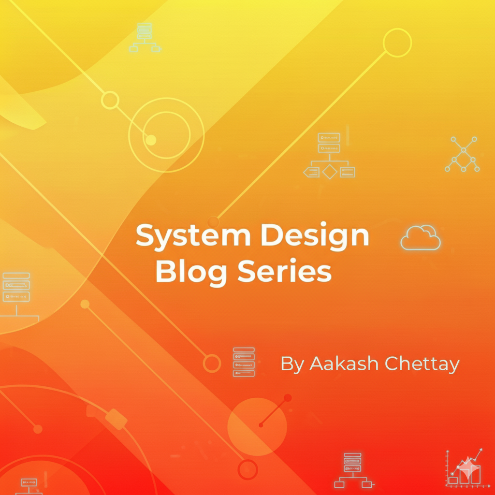

**Post link:** https://www.linkedin.com/posts/aakash-chettay_systemdesign-softwareengineering-tech-activity-7371262691300036609-aq89?utm_source=share&utm_medium=member_desktop&rcm=ACoAADpOTjcByXZJ8DZ_mH8Pwi3EwW3XkoZT5dY   

**Content:**  
Ready to level up your career from just a coder to a system architect? 🚀  

That’s my mission, and I'm inviting you to join me. I’m kicking off a weekly blog series to demystify System Design, one of the most critical skills for landing a top-tier SDE role. 🎯  

For this series, a solid grasp of Object-Oriented Programming (OOP) using Java will be a helpful starting point. ☕  

Every Sunday 🗓️, I’ll be sharing a deep dive, starting with the foundational SOLID principles this weekend. Then, we'll crack the code on all 23 Design Patterns, complete with my own real-world, self-created examples. 🛠️  

I believe consistency is key to mastery, and this blog is my public commitment. Let’s build our knowledge base, one pattern at a time. 🏗️  

If you’re ready to grow, learn, and master the art of building scalable systems, hit that follow button and join the journey! 👉  

#SystemDesign #SoftwareEngineering #Tech #CareerGrowth #Java #DesignPatterns #AmazonSDE #Coding #TechBlog #LearningJourney #Developers #CodingLife #SoftwareDeveloper #OOP #CareerChange  

