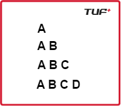

Given an integer n. You need to recreate the pattern given below for any value of N. Let's say for N = 5, the pattern should look like as below:

A
AB
ABC
ABCD
ABCDE

Print the pattern in the function given to you.

Examples:

Input: n = 4
Output:

Input: n = 2
Output:

Constraints:
1 <= n <= 26