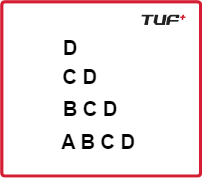

Given an integer n. You need to recreate the pattern given below for any value of N. Let's say for N = 5, the pattern should look like as below:

Print the pattern in the function given to you.

Examples:
Input: n = 4

Output: 

Input: n = 2

Output: 

Constraints:
1 <= n <= 26
