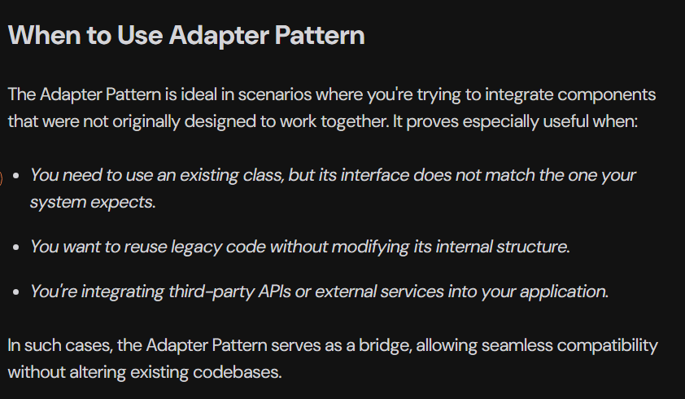
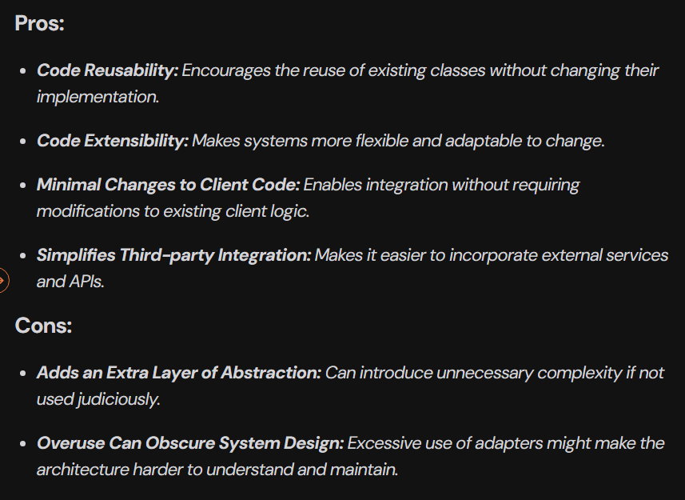

**Adapter Pattern**<br><br>
**Defination:**<br>
The Adapter Pattern allows incompatible interfaces to work together by acting as a translator or wrapper around an existing class. It converts the interface of a class into another interface that a client expects.
<br><br>
It acts as a bridge between the Target interface (expected by the client) and the Adaptee (an existing class with a different interface). This structural wrapping enables integration and compatibility across diverse systems.<br><br>

**Real life analogy:**
As it's name suggests, when you move to US, your Indian charger doesn't support US plug points, so instead of modifying neither charger nor plug point, you just add a travel adapter to your current charger. Which solves the entire problem. Same way, here we create an Adapter class which solves the issue.<br><br>
**Problem It Solves**<br><br>
1. Interface incompatibility between classes.
2. Reusability of existing classes without modifying their source code.
3. Enables systems to communicate that otherwise couldn't due to differing method signatures.<br><br>
**Real-Life Coding Example**<br><br>
**Using Incompatible Interface (Without Adapter)**<br>
```
import java.util.*;

// Target Interface: 
// Standard interface expected by the CheckoutService
interface PaymentGateway {
    void pay(String orderId, double amount);
}

// Concrete implementation of PaymentGateway for PayU
class PayUGateway implements PaymentGateway {
    @Override
    public void pay(String orderId, double amount) {
        System.out.println("Paid Rs. " + amount + " using PayU for order: " + orderId);
    }
}

// Adaptee: 
// An existing class with an incompatible interface
class RazorpayAPI {
    public void makePayment(String invoiceId, double amountInRupees) {
        System.out.println("Paid Rs. " + amountInRupees + " using Razorpay for invoice: " + invoiceId);
    }
}

// Client Class:
// Uses PaymentGateway interface to process payments
class CheckoutService {
    private PaymentGateway paymentGateway;

    // Constructor injection for dependency inversion
    public CheckoutService(PaymentGateway paymentGateway) {
        this.paymentGateway = paymentGateway;
    }

    // Business logic to perform checkout
    public void checkout(String orderId, double amount) {
        paymentGateway.pay(orderId, amount);
    }
}

class Main {
    public static void main(String[] args) {
        // Using PayU payment gateway to process payment
        CheckoutService checkoutService = 
            new CheckoutService(new PayUGateway());
            
        checkoutService.checkout("12", 1780);
    }
}
```
**Using Adapter Pattern**<br><br>
```
import java.util.*;

// Target Interface: 
// Standard interface expected by the CheckoutService
interface PaymentGateway {
    void pay(String orderId, double amount);
}

// Concrete implementation of PaymentGateway for PayU
class PayUGateway implements PaymentGateway {
    @Override
    public void pay(String orderId, double amount) {
        System.out.println("Paid Rs." + amount + " using PayU for order: " + orderId);
    }
}

// Adaptee: 
// An existing class with an incompatible interface
class RazorpayAPI {
    public void makePayment(String invoiceId, double amountInRupees) {
        System.out.println("Paid Rs." + amountInRupees + " using Razorpay for invoice: " + invoiceId);
    }
}

// Adapter Class:
// Allows RazorpayAPI to be used where PaymentGateway is expected
class RazorpayAdapter implements PaymentGateway {
    private RazorpayAPI razorpayAPI;
    
    public RazorpayAdapter() {
        this.razorpayAPI = new RazorpayAPI();
    }
    
    // Translates the pay() call to RazorpayAPI's makePayment() method
    @Override
    public void pay(String orderId, double amount) {
        razorpayAPI.makePayment(orderId, amount); 
    }
}


// Client Class:
// Uses PaymentGateway interface to process payments
class CheckoutService {
    private PaymentGateway paymentGateway;

    // Constructor injection for dependency inversion
    public CheckoutService(PaymentGateway paymentGateway) {
        this.paymentGateway = paymentGateway;
    }

    // Business logic to perform checkout
    public void checkout(String orderId, double amount) {
        paymentGateway.pay(orderId, amount);
    }
}

class Main {
    public static void main(String[] args) {
        // Using razorpay payment gateway adapter to process payment
        CheckoutService checkoutService = 
            new CheckoutService(new RazorpayAdapter());
            
        checkoutService.checkout("12", 1780);
    }
}
```
**When to use Adapter Pattern.**<br><br>

**Pros & cons**<br><br>
<br><br>
**Real Product Use Cases**<br><br>
The Adapter Pattern is not just a theoretical concept — it plays a crucial role in real-world software products and systems. Many enterprise-level applications rely on this pattern to integrate with third-party tools, legacy systems, and platform-specific APIs. Below are some common and impactful use cases:

1.**Payment Gateways**<br>
Scenario: Different payment providers (e.g., PayPal, Stripe, Razorpay, PayU) expose their own APIs with varying method names, parameters, and response formats.

**Adapter Use:** By implementing a common PaymentGateway interface and creating adapters for each provider, businesses can switch or support multiple gateways without rewriting business logic. This decouples the checkout flow from provider-specific implementations.
2. **Logging Frameworks**
Scenario: Enterprise applications often need to support different logging libraries like Log4j, SLF4J, or custom logging solutions.

**Adapter Use:** An adapter can unify the logging interface so developers can write log.debug(...), regardless of whether the underlying implementation is Log4j or java.util.logging. This makes it easier to switch or support multiple logging backends with minimal changes.
3. **Cloud Providers and SDKs**
Scenario: Cloud platforms like AWS, Azure, and Google Cloud offer similar functionalities (storage, compute, database) but expose them through different SDKs and APIs.

**Adapter Use:** Using an adapter layer, developers can abstract cloud operations behind a common interface, enabling them to change providers (e.g., from AWS S3 to Google Cloud Storage) without impacting the rest of the application. This is particularly useful for hybrid-cloud or multi-cloud strategies.<br><br>
**Class Diagram**<br><br>
