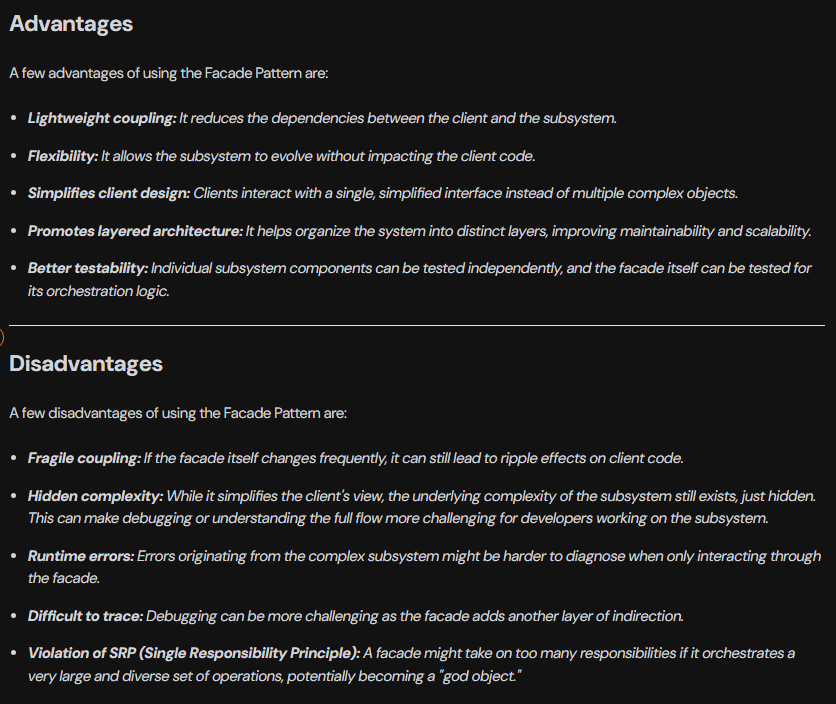

**Facade Pattern**<br><br>
The Facade Pattern is a Structural Design Pattern that provides a simplified, unified interface to complex sub systems or group of classes.<br><br>
It acts as a single entry point for clients to interact with the system, hiding the underlying complexity and making the system easier to use.<br><br>
**Real-Life Analogy**<br><br>
**Think of Manual vs. Automatic Car:**
1. **Complex Subsystem (Manual Car):** Driving a manual car requires intricate knowledge of multiple components (clutch, gear shifter, accelerator) and their precise coordination to shift gears and drive. It's complex and requires the driver to manage many interactions.
2. **Facade (Automatic Car):** An automatic car acts as a facade. It provides a simplified interface (e.g., "Drive," "Reverse," "Park") to the complex underlying mechanics of gear shifting. The driver (client) no longer needs to manually coordinate the clutch and gears; the automatic transmission handles these complexities internally, making driving much easier.

In short, the manual car exposes the complexity, while the automatic car (the facade) simplifies it for the user<br><br>
**Problem It Solves**<br><br>
It solves the problem of dealing with complex subsystems by hiding the complexities behind a single, unified interface.<br><br>
For example, imagine a movie ticket booking system with:
* PaymentService
* SeatReservationService
* NotificationService
* LoyaltyPointsService
* TicketService

Instead of making the client interact with all of these directly, the Facade Pattern provides a single class like MovieBookingFacade, which internally coordinates all the services.

**The Bad Way (Without Using Facade pattern)**
```
// Service class responsible for handling payments
class PaymentService {
    public void makePayment(String accountId, double amount) {
        System.out.println("Payment of ₹" + amount + " successful for account " + accountId);
    }
}

// Service class responsible for reserving seats
class SeatReservationService {
    public void reserveSeat(String movieId, String seatNumber) {
        System.out.println("Seat " + seatNumber + " reserved for movie " + movieId);
    }
}

// Service class responsible for sending notifications
class NotificationService {
    public void sendBookingConfirmation(String userEmail) {
        System.out.println("Booking confirmation sent to " + userEmail);
    }
}

// Service class for managing loyalty/reward points
class LoyaltyPointsService {
    public void addPoints(String accountId, int points) {
        System.out.println(points + " loyalty points added to account " + accountId);
    }
}

// Service class for generating movie tickets
class TicketService {
    public void generateTicket(String movieId, String seatNumber) {
        System.out.println("Ticket generated for movie " + movieId + ", Seat: " + seatNumber);
    }
}

// Client Code
class Main {
    public static void main(String[] args) {
        // Booking a movie ticket manually (without a facade)

        // Step 1: Make payment
        PaymentService paymentService = new PaymentService();
        paymentService.makePayment("user123", 500);

        // Step 2: Reserve seat
        SeatReservationService seatReservationService = new SeatReservationService();
        seatReservationService.reserveSeat("movie456", "A10");

        // Step 3: Send booking confirmation via email
        NotificationService notificationService = new NotificationService();
        notificationService.sendBookingConfirmation("user@example.com");

        // Step 4: Add loyalty points to user's account
        LoyaltyPointsService loyaltyPointsService = new LoyaltyPointsService();
        loyaltyPointsService.addPoints("user123", 50);

        // Step 5: Generate the ticket
        TicketService ticketService = new TicketService();
        ticketService.generateTicket("movie456", "A10");
    }
}
```
**Using Facade Pattern**
```
// Service class responsible for handling payments
class PaymentService {
    public void makePayment(String accountId, double amount) {
        System.out.println("Payment of ₹" + amount + " successful for account " + accountId);
    }
}

// Service class responsible for reserving seats
class SeatReservationService {
    public void reserveSeat(String movieId, String seatNumber) {
        System.out.println("Seat " + seatNumber + " reserved for movie " + movieId);
    }
}

// Service class responsible for sending notifications
class NotificationService {
    public void sendBookingConfirmation(String userEmail) {
        System.out.println("Booking confirmation sent to " + userEmail);
    }
}

// Service class for managing loyalty/reward points
class LoyaltyPointsService {
    public void addPoints(String accountId, int points) {
        System.out.println(points + " loyalty points added to account " + accountId);
    }
}

// Service class for generating movie tickets
class TicketService {
    public void generateTicket(String movieId, String seatNumber) {
        System.out.println("Ticket generated for movie " + movieId + ", Seat: " + seatNumber);
    }
}


// ========== The MovieBookingFacade class  ==============
class MovieBookingFacade {
    private PaymentService paymentService;
    private SeatReservationService seatReservationService;
    private NotificationService notificationService;
    private LoyaltyPointsService loyaltyPointsService;
    private TicketService ticketService;

    // Constructor to initialize all the subsystem services.
    public MovieBookingFacade() {
        this.paymentService = new PaymentService();
        this.seatReservationService = new SeatReservationService();
        this.notificationService = new NotificationService();
        this.loyaltyPointsService = new LoyaltyPointsService();
        this.ticketService = new TicketService();
    }

    // Method providing a simplified interface for booking a movie ticket
    public void bookMovieTicket(String accountId, String movieId, String seatNumber, String userEmail, double amount) {
        paymentService.makePayment(accountId, amount);
        seatReservationService.reserveSeat(movieId, seatNumber);
        ticketService.generateTicket(movieId, seatNumber);
        loyaltyPointsService.addPoints(accountId, 50);
        notificationService.sendBookingConfirmation(userEmail);

        // Indicate successful completion of the entire booking process.
        System.out.println("Movie ticket booking completed successfully!");
    }
}


// Client Code
class Main {
    public static void main(String[] args) {
        // Booking a movie ticket manually (using facade)
        MovieBookingFacade movieBookingFacade = new MovieBookingFacade();
        movieBookingFacade.bookMovieTicket("user123", "movie456", "A10", "user@example.com", 500);
    }
}
```
**How Facade Pattern Solves the Issue**<br><br>
By introducing MovieBookingFacade, we:
* Provide a simple, unified interface (bookMovieTicket()).
Hide the complexity of internal service calls from the client.
* Reduce coupling, so changes in internal services don't affect the client.
* Centralize the workflow logic, making it easier to update and reuse.
**When to use Facade Pattern?**<br><br>
You should use use Facade pattern when:

* **Subsystems are complex:** This means there are too many classes and too many dependencies within the system you are trying to simplify.
* **You want to provide a simpler API for the outer world:** The Facade acts as a simplified entry point, hiding the complexity from clients.
* You want to reduce coupling between subsystems and client code: By interacting with the facade, the client code becomes less dependent on the individual components of the subsystem.
* **You want to layer your architecture cleanly:** The Facade helps in organizing the system into distinct layers, making it more modular and understandable.<br><br>
**Pros and Cons**<br><br>
<br><br>
**Class Diagram**<br><br>
