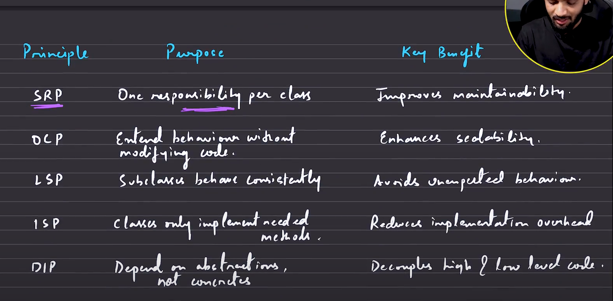
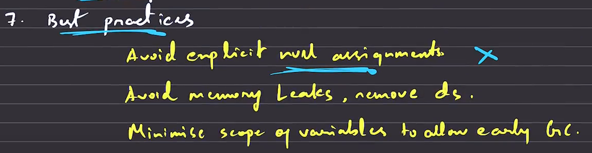
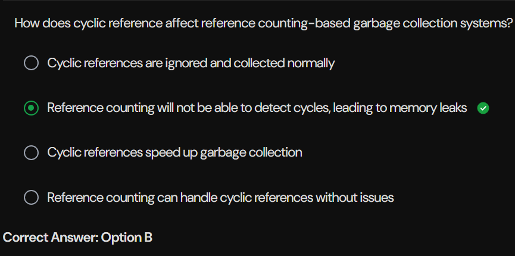
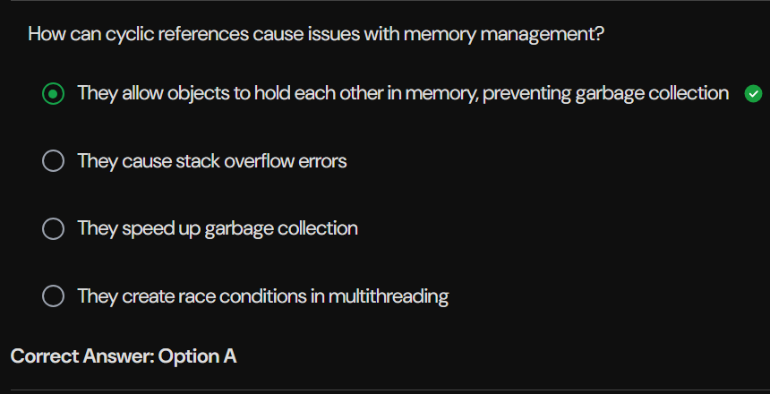

**SOLID Principles in Object-Oriented Programming**

S - (SRP) Single Responsibility Principle 
O - (OCP) Open/Closed Principle
L - (LSP) Lisknov Substitution Principle 
I - (ISP) Interfaces Segregation Principle
D - (DIP) Dependencies Inversion Principe 

**Object Life Cycle in Java**
Creation -> Usage -> Garbage Collection -> Destruction

__Object Creation:__ It happens using new keyword. Like new Classroom(), new Book()...These new instances are stored in a heap memory.

__Garbage Collector:__ GC in java destroys the object which is in the heap memory. It get to know that it should destroy the object when it's **Reference Count** is 0
GC uses **Mark & Sweep** to perform it's task. When main function is done, stack will be clear and no variables are refering to the objects. So GC gors through the heap memory and mark the unused objects and perform Generational Garbace Collection Algo to clear them.
**system.gc()** -> Asking the system to collect garbage, but not sure it work 100% at that moment itself.

__Reference Counting:__ It is the count maintained my java for each individual object, counting the number of instances pointing to it.
Ex:
Example obj1 = new Example(); // obj1 is one reference. Ref Cnt = 1
Example obj2 = obj1; // obj2 is also refering to the same object, so Ref Cnt = 2
obj1 = null; so Ref Cnt = 1 // decreases by 1

__Memory Leaks__ are possible by using static variables. And these aren't cleard by GC, bcoz it is tied to the class not object.

__Cyclic References:__ A standalone object A pointing to another standalone object B which is pointing the object A and those are inside heap. These prevent Garbace Collection.

**Tricky MCQ's**

