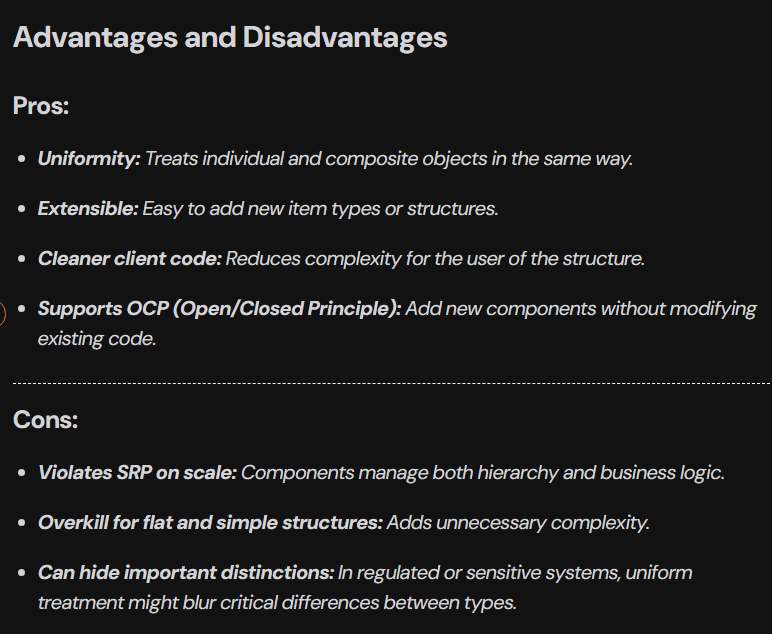

**Composite Pattern**<br><br>
The Composite Pattern is a structural design pattern that allows you to compose objects into tree structures to represent part-whole hierarchies. It lets clients treat individual objects and compositions of objects uniformly.<br><br>
**Problem It Solves**<br><br>
The Composite Pattern solves the problem of treating individual objects and groups of objects in the same way. The main problem arises when:
* You want to work with a hierarchy of objects.
* You want the client code to be agnostic to whether it's dealing with a single object or a collection of them.<br><br>
**Understanding the Problem**<br><br>
Consider you are building the checkout service of an e-commerce application and you take the following approach as shown in the code below.

**Code (Without Composite Pattern)**<br><br>
```
import java.util.*;

// Represents a single product
class Product {
    private String name;
    private double price;
    
    public Product(String name, double price) {
        this.name = name;
        this.price = price;
    }

    public double getPrice() {
        return price;
    }

    public void display(String indent) {
        System.out.println(indent + "Product: " + name + " - ₹" + price);
    }
}

// Represents a bundle of products
class ProductBundle {
    private String bundleName;
    private List<Product> products = new ArrayList<>();
    
    public ProductBundle(String bundleName) {
        this.bundleName = bundleName;
    }

    public void addProduct(Product product) {
        products.add(product);
    }

    public double getPrice() {
        double total = 0;
        for (Product product : products) {
            total += product.getPrice();
        }
        return total;
    }

    public void display(String indent) {
        System.out.println(indent + "Bundle: " + bundleName);
        for (Product product : products) {
            product.display(indent + "  ");
        }
    }
}

// Main logic
class Main {
    public static void main(String[] args) {
        // Individual Items
        Product book = new Product("Book", 500);
        Product headphones = new Product("Headphones", 1500);
        Product charger = new Product("Charger", 800);
        Product pen = new Product("Pen", 20);
        Product notebook = new Product("Notebook", 60);
        
        // Bundle: Iphone Combo
        ProductBundle iphoneCombo = new ProductBundle("iPhone Combo Pack");
        iphoneCombo.addProduct(headphones);
        iphoneCombo.addProduct(charger);
    
        // Bundle: School Kit
        ProductBundle schoolKit = new ProductBundle("School Kit");
        schoolKit.addProduct(pen);
        schoolKit.addProduct(notebook);
        
        // Add to cart logic
        List<Object> cart = new ArrayList<>();
        cart.add(book);
        cart.add(iphoneCombo);
        cart.add(schoolKit);
        
        // Display Cart    
        double total = 0;
        System.out.println("Cart Details:\n");

        for (Object item : cart) {
            if (item instanceof Product) {
                ((Product) item).display("  ");
                total += ((Product) item).getPrice();
            } else if (item instanceof ProductBundle) {
                ((ProductBundle) item).display("  ");
                total += ((ProductBundle) item).getPrice();
            }
        }

        System.out.println("\nTotal Price: ₹" + total);
    }
}
```
**Working of Code**<br><br>
* Product class represents a simple item with name and price.
* ProductBundle class represents a group of products bundled together.
* Both classes have methods to display and return their prices.
* In main(), individual products and bundles are created and added to the cart.
* The cart is a List<Object> that holds both products and bundles.
* During checkout, the code checks each item's type using instanceof.
* Based on the type, it casts the object and calls its respective methods.
* Finally, it displays all items and calculates the total price.<br><br>
**Problem in above code**<br><br>
In the above example, the code lacks the structure to treat individual and group items uniformly, i.e., In the current implementation, individual products (Product) and product bundles (ProductBundle) are completely separate types with no shared interface or superclass. This means we cannot write code that treats both uniformly and the logic always has to check which type we're working with.<br><br>

Other than these, there are some other problems as well:
* instanceof is used repeatedly, breaking polymorphism.
* Cart uses List<Object>, which is unsafe and violates abstraction.
* ProductBundle cannot contain another ProductBundle (no recursive structure).
* Display and price logic are duplicated instead of unified.

**Refactored Code Using Composite Pattern**<br>
Let's refactor the code using the Composite Pattern. The idea is to create a common interface CartItem for both Product and ProductBundle, allowing us to treat them uniformly.
```
import java.util.*;

// Interface for items that can be added to the cart
interface CartItem {
    double getPrice();
    void display(String indent);
}

// Product class implementing CartItem
class Product implements CartItem {
    private String name;
    private double price;

    public Product(String name, double price) {
        this.name = name;
        this.price = price;
    }

    @Override
    public double getPrice() {
        return price;
    }

    @Override
    public void display(String indent) {
        System.out.println(indent + "Product: " + name + " - ₹" + price);
    }
}

// ProductBundle class implementing CartItem
class ProductBundle implements CartItem {
    private String bundleName;
    private List<CartItem> items = new ArrayList<>();

    public ProductBundle(String bundleName) {
        this.bundleName = bundleName;
    }

    public void addItem(CartItem item) {
        items.add(item);
    }

    @Override
    public double getPrice() {
        double total = 0;
        for (CartItem item : items) {
            total += item.getPrice();
        }
        return total;
    }

    @Override
    public void display(String indent) {
        System.out.println(indent + "Bundle: " + bundleName);
        for (CartItem item : items) {
            item.display(indent + "  ");
        }
    }
}

// Main class
class Main {
    public static void main(String[] args) {
        // Individual Products
        CartItem book = new Product("Atomic Habits", 499);
        CartItem phone = new Product("iPhone 15", 79999);
        CartItem earbuds = new Product("AirPods", 15999);
        CartItem charger = new Product("20W Charger", 1999);

        // Combo Deal
        ProductBundle iphoneCombo = new ProductBundle("iPhone Essentials Combo");
        iphoneCombo.addItem(phone);
        iphoneCombo.addItem(earbuds);
        iphoneCombo.addItem(charger);

        // Back to School Kit
        ProductBundle schoolKit = new ProductBundle("Back to School Kit");
        schoolKit.addItem(new Product("Notebook Pack", 249));
        schoolKit.addItem(new Product("Pen Set", 99));
        schoolKit.addItem(new Product("Highlighter", 149));

        // Add everything to cart
        List<CartItem> cart = new ArrayList<>();
        cart.add(book);
        cart.add(iphoneCombo);
        cart.add(schoolKit);

        // Display cart
        System.out.println("Your Amazon Cart:");
        double total = 0;
        for (CartItem item : cart) {
            item.display("  ");
            total += item.getPrice();
        }

        System.out.println("\nTotal: ₹" + total);
    }
}
```
**Working of Refactored Code**<br><br>
* CartItem interface defines the common methods for both products and bundles.
* Product and ProductBundle classes implement the CartItem interface.
* The cart now holds a list of CartItem, allowing us to treat both products and bundles uniformly.
* The display and price calculation logic is simplified, as we no longer need to check types.
**Understanding Leaf and Composite in the Composite Pattern**<br><br>
In the Composite Design Pattern, we categorize components into two main roles:
* **Leaf (Individual Object):** A Leaf is a simple, atomic object in the structure. It does not contain any child components. In our example:
    * Product is a Leaf.
    * It represents individual purchasable items like books, phones, pens, etc.
    * Implements CartItem and provides its own getPrice() and display() logic.
* **Composite (Container of Components):** A Composite is a complex object that can hold multiple CartItem objects, including both Leaf and other Composite objects. In our example:
    * ProductBundle is a Composite.
    * It can contain Products (leaves) and even other ProductBundles (nested composites).
    * Implements CartItem and delegates actions (getPrice() and display()) to its children.<br><br>
<br><br>
<br><br>
<br><br>
