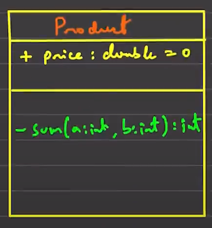
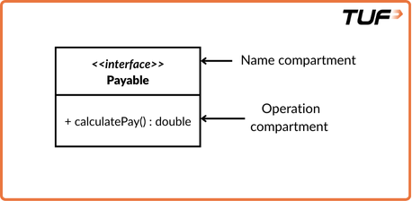
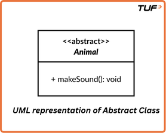

**UML**
* At first we shouldn't write any code. It's not preferable. Building class diagrams is advisable. 
__Class Notation:__
    __Class Representation__
        __Class Name:__ (Top)
        __Attributes:__ (Middle)
        __Operations:__ (Bottom)    
        __Figure:__ 
         
    __Visibility Markers:__
        Public +
        Private -
        Protected #
        Package ~
    __Attribute & Method Syntax:__
        __Attribute:__ visibility name: Type [multiplicity] = DefaultValue (Ex: + age: int = 21)
        __Method:__ visibility name(parameterName1: Type1,...): ReturnType (Ex: - isAdult(age:int): boolean)
        __Interface Representation:__
         
        __Abstract Class Representation:__
         
        
        Abstract class is denoted in italic foramt

