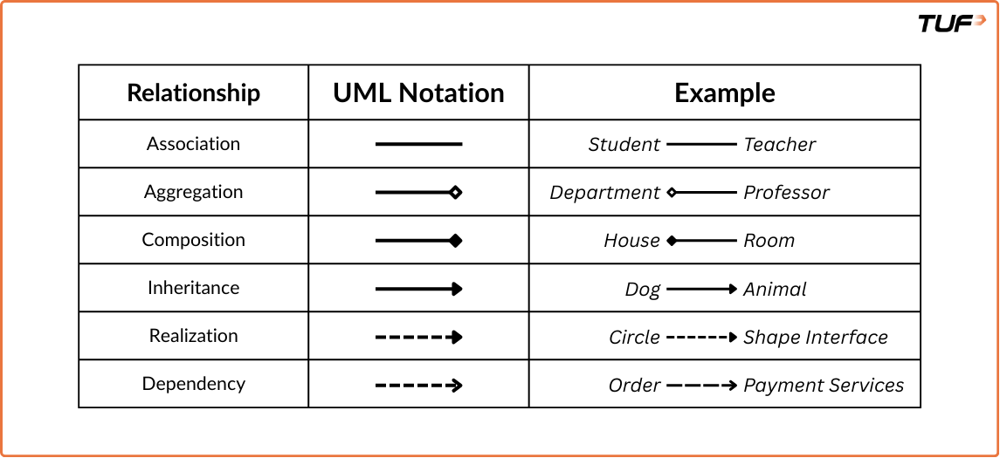

**UML**
* At first we shouldn't write any code. It's not preferable. Building class diagrams is advisable.  
__Class Notation:__
    __Class Representation__ 
        __Class Name:__ (Top) 
        __Attributes:__ (Middle) 
        __Operations:__ (Bottom)  
        __Figure:__  
         
    __Visibility Markers:__ 
        Public + 
        Private - 
        Protected # 
        Package ~  
    __Attribute & Method Syntax:__ 
        __Attribute:__ visibility name: Type [multiplicity] = DefaultValue (Ex: + age: int = 21) 
        __Method:__ visibility name(parameterName1: Type1,...): ReturnType (Ex: - isAdult(age:int): boolean)  
        __Interface Representation:__ 
          
        __Abstract Class Representation:__ 
          
        Abstract class is denoted in italic foramt  
    __Relationship and their denotion with example:__  
        

