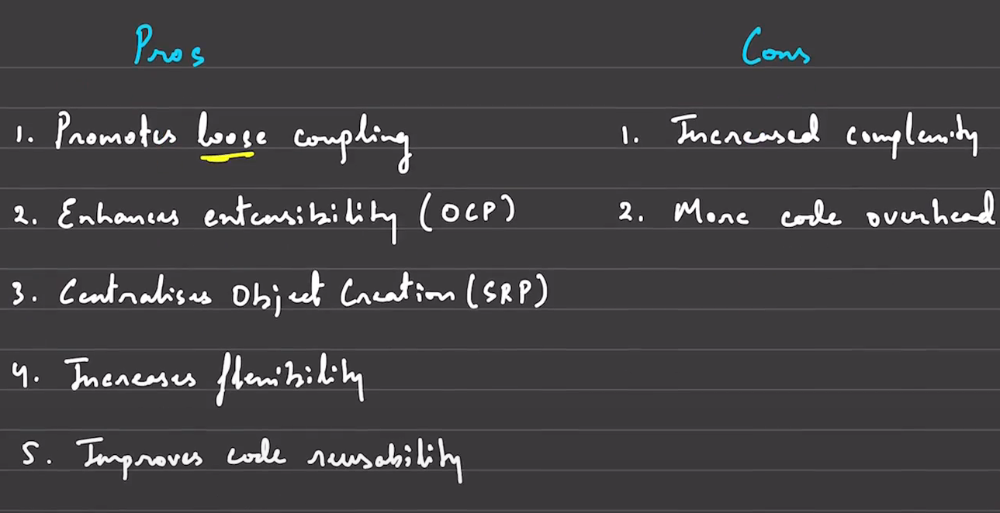
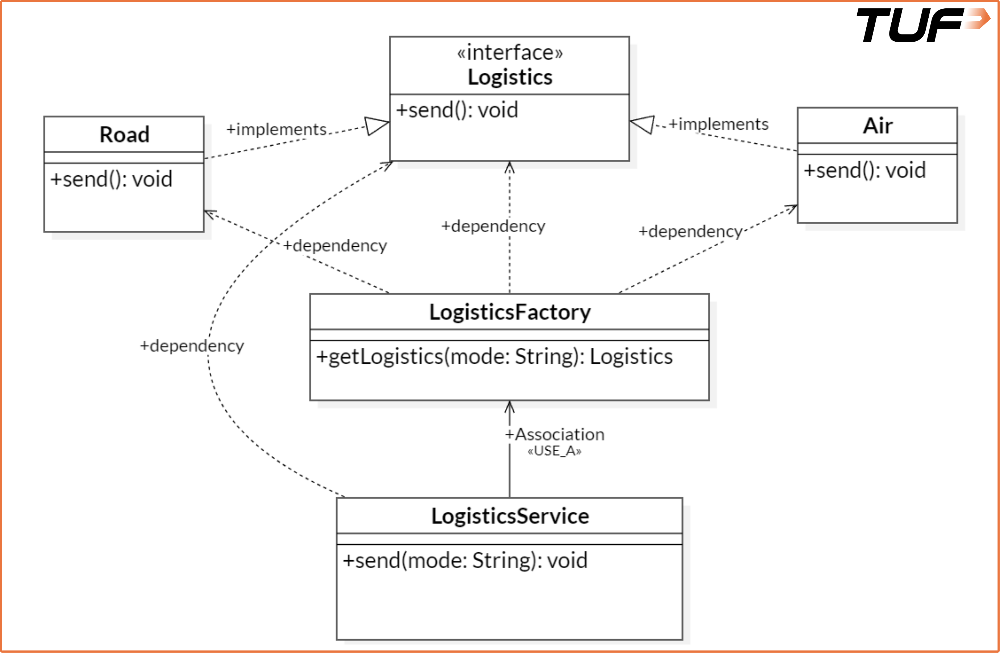
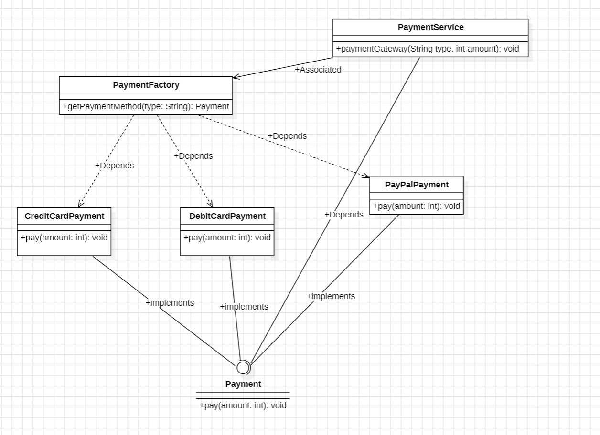

**Creational Design Patterns:**<br><br>
1. __Singleton Pattern:__ The Singleton Pattern ensures that a class has only one instance and provides a global point of access to that instance.<br><br>
__Why Is It a Creational Pattern?__<br>
The Singleton Pattern falls under the creational design patterns. This is because it deals with how objects are created. Unlike simple instantiation (new), Singleton controls the object creation process by returning an existing instance rather than creating a new one.<br><br>
__Working of Singleton Pattern__<br>
The Singleton Pattern typically involves the following steps:

* Private constructor: Prevents instantiation from outside the class.
* Static variable: Holds the single instance of the class.
* Public static method: Provides a global access point to get the instance.<br><br>

This ensures that no matter how many times you call the method to get an instance, it will always return the same object.<br><br>

__Approaches to Implement Singleton Pattern:__
* Eager Loading
* Lazy Loading<br><br>
1. __Eager Loading (Early Initialization):__<br><br>
In Eager Loading, the Singleton instance is created as soon as the class is loaded, regardless of whether it's ever used.<br><br>

```
// Class implementing Eager Loading
class EagerSingleton {
    private static final EagerSingleton instance = new EagerSingleton();

    // private constructor
    private EagerSingleton() {
        // Declaring it private prevents creation of its object using the new keyword
    }

    // Method to get the instance of class
    public static EagerSingleton getInstance() {
        return instance; // Always returns the same instance 
    }
}
```
* For deep info, pros and cons..__Google__ it or refer primary source.<br><br>
2. __Lazy Loading (On-Demand Initialization):__<br><br>
In Lazy Loading, the Singleton instance is created only when it's needed — the first time the getInstance() method is called.

```
// Class implementing Lazy Loading
class LazySingleton {
    // Object declaration
    private static LazySingleton instance;

    // private constructor
    private LazySingleton() {
        // Declaring it private prevents creation of its object using the new keyword
    }

    // Method to get the instance of class
    public static LazySingleton getInstance() {
        // If the object is not created 
        if (instance == null) {
            // A new object is created
            instance = new LazySingleton();
        }

        // Otherwise the already created object is returned
        return instance;
    }
}
```
* For deep info, pros and cons..__Google__ it or refer primary source.<br><br>

**Thread Safety: A Critical Concern in Singleton Pattern**<br><br>
In a single-threaded environment, implementing a Singleton is straightforward. However, things get complicated in multi-threaded applications, which are very common in modern software (especially web servers, mobile apps, etc.).<br><br>

**The Problem**<br><br>
Let's say two threads simultaneously call getInstance() for the first time in a lazy-loaded Singleton. If the instance hasn't been created yet, both threads might pass the null check and end up creating two different instances — completely breaking the Singleton guarantee.

This kind of bug is:
* Hard to detect, as it may not occur every time.
* Severe, because it defeats the whole purpose of the pattern.
* Costly, especially if the Singleton manages critical resources like logging, configuration, or DB connections.<br><br>
**Different Ways to Achieve Thread Safety**<br><br>
1. **Synchronized Method**<br><br>
```
public class Singleton {
    // Object declaration
    private static Singleton instance;

    // Private constructor
    private Singleton() {}

    // Synchronized keyword used
    public static synchronized Singleton getInstance() {
        if (instance == null) {
            instance = new Singleton();
        }
        return instance;
    }
}
```
2. **Double-Checked Locking**<br><br>
```
public class Singleton {
    // Volatile object declaration
    private static volatile Singleton instance;

    // Private constructor
    private Singleton() {}

    // Thread-safe method using double-checked locking
    public static Singleton getInstance() {
        if (instance == null) {
            synchronized (Singleton.class) {
                if (instance == null) {
                    instance = new Singleton();
                }
            }
        }
        return instance;
    }
}
```
3. **Bill Pugh Singleton (Best Practice for Lazy Loading)**<br><br>
```
public class Singleton {
    // Private constructor
    private Singleton() {}

    // Static inner class to hold the Singleton instance
    private static class Holder {
        private static final Singleton INSTANCE = new Singleton();
    }

    // Public method to return the Singleton instance
    public static Singleton getInstance() {
        return Holder.INSTANCE;
    }
}
```
4. **Eager Loading(Memory Inefficient)**
As discussed earlier, eager loading does not face thread safety issues. This approach avoids thread issues altogether by creating the instance upfront — at the cost of potential memory waste. Thus, it is not a preferred method in most cases but is still a valid option.<br><br>

**Conclusion**
The Singleton pattern can be a powerful tool when used appropriately, particularly for managing global states and shared resources. However, developers should be mindful of its drawbacks, especially regarding testing and maintainability. Consider alternatives or enhanced implementations (like dependency injection) where appropriate to maintain clean and scalable codebases.

2. **Factory Method** <br><br>
The Factory Pattern is a creational design pattern that provides an interface for creating objects but allows subclasses to alter the type of objects that will be created.<br><br>
**When Should You Use It?**<br><br>
We can use the Factory Pattern when:
* The client code needs to work with multiple types of objects.
* The decision of which class to instantiate must be made at runtime.
* The instantiation process is complex or needs to be controlled.<br><br>
**Real-World Analogy: Ordering Pizza**<br><br>
Imagine you walk into a pizza shop and say, “I'd like a pizza.” The shop doesn't ask you to go into the kitchen and make it yourself. Instead, it asks, “Which type? Margherita? Pepperoni? Veggie?” Based on your choice, the kitchen (factory) creates the specific pizza for you and hands it over.<br><br>

You (the client), don't care how it's made or what specific class of ingredients is used. You just want your pizza. The factory (kitchen) handles the creation logic behind the scenes.<br><br>

This is exactly what the Factory Pattern does in code: it creates an object based on some input without exposing the instantiation logic to the client.<br><br>
**Basic Structure of Factory Pattern**<br><br>
The Factory Pattern typically consists of the following components:

1. **Product**: It is an interface or abstract class that defines the methods the product must implement.
2. **Concrete Products**: The concrete classes that implement the Product interface.
3. **Factory**: A class with a method that returns different concrete products based on input.<br><br>
```
// Logistic Interface
interface Logistics {
    void send();
}

// Class implementing the Logistics Interface
class Road implements Logistics {
    @Override
    public void send() {
        System.out.println("Sending by road logic");
    }
}

// Class implementing the Logistics Interface
class Air implements Logistics {
    @Override
    public void send() {
        System.out.println("Sending by air logic");
    }
}

// Factory Class taking care of Logistics
class LogisticsFactory {
    public static Logistics getLogistics(String mode) {
        if (mode.equalsIgnoreCase("Air")) {
            return new Air();
        } else if (mode.equalsIgnoreCase("Road")) {
            return new Road();
        }
        throw new IllegalArgumentException("Unknown logistics mode: " + mode);
    }
}

// Class implementing the Logistics Services
class LogisticsService {
    public void send(String mode) {
        /* Using the Logistics Factory to get the 
        desired object based on the mode */
        Logistics logistics = LogisticsFactory.getLogistics(mode);
        logistics.send();
    }
}

// Driver Code
class Main {
    public static void main(String[] args) {
        LogisticsService service = new LogisticsService();
        service.send("Air");
        service.send("Road");
    }
}

```
**Pros and Cons**<br><br>
<br><br>
**Class Diagram**
<br><br>
**Payments Factory Pattern Class Diagram**<br><br>
<br><br>
**Note:** Arrow is dotted between PaymentService and Payment. It's a dependency.