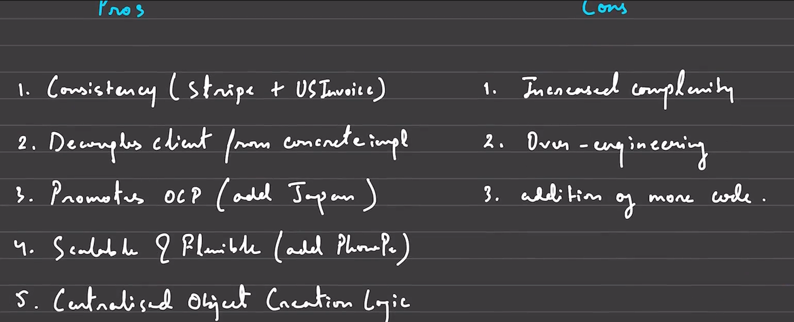
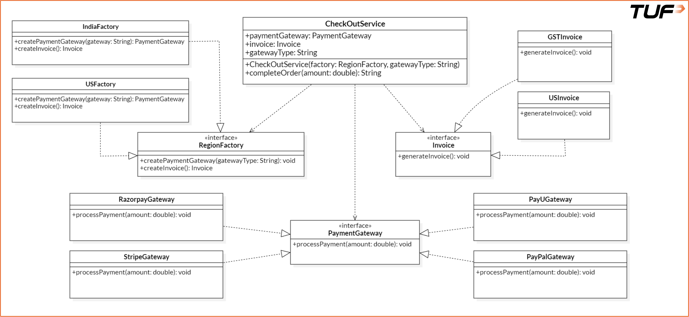

**Abstract Factory Pattern**<br><br>
The Abstract Factory Pattern is a creational design pattern that provides an interface for creating families of related or dependent objects without specifying their concrete classes.<br><br>
**In simpler terms:**<br><br>
You use it when you have multiple factories, each responsible for producing objects that are meant to work together.<br><br>
**When Should You Use It?**<br><br>
Use of the Abstract Factory Pattern is appropriate in the following scenarios:<br>
* When multiple related objects must be created as part of a cohesive set (e.g., a payment gateway and its corresponding invoice generator).<br>
* When the type of objects to be instantiated depends on a specific context, such as country, theme, or platform.<br>
* When client code should remain independent of concrete product classes.<br>
* When consistency across a family of related products must be maintained (e.g., a US payment gateway paired with a US-style invoice).<br><br>
**Real Life Example**<br><br>
**Bad Design**
```
// Interface representing any payment gateway
interface PaymentGateway {
    void processPayment(double amount);
}

// Concrete implementation: Razorpay
class RazorpayGateway implements PaymentGateway {
    public void processPayment(double amount) {
        System.out.println("Processing INR payment via Razorpay: " + amount);
    }
}

// Concrete implementation: PayU
class PayUGateway implements PaymentGateway {
    public void processPayment(double amount) {
        System.out.println("Processing INR payment via PayU: " + amount);
    }
}

// Interface representing invoice generation
interface Invoice {
    void generateInvoice();
}

// Concrete invoice implementation for India
class GSTInvoice implements Invoice {
    public void generateInvoice() {
        System.out.println("Generating GST Invoice for India.");
    }
}

// CheckoutService that directly handles object creation (bad practice)
class CheckoutService {
    private String gatewayType;

    // Constructor accepts a string to determine which gateway to use
    public CheckoutService(String gatewayType) {
        this.gatewayType = gatewayType;
    }

    // Checkout process hardcodes logic for gateway and invoice creation
    public void checkOut(double amount) {
        PaymentGateway paymentGateway;

        // Hardcoded decision logic
        if (gatewayType.equals("razorpay")) {
            paymentGateway = new RazorpayGateway();
        } else {
            paymentGateway = new PayUGateway();
        }

        // Process payment using selected gateway
        paymentGateway.processPayment(amount);

        // Always uses GSTInvoice, even though more types may exist later
        Invoice invoice = new GSTInvoice();
        invoice.generateInvoice();
    }
}

// Main method
class Main {
    public static void main(String[] args) {
        // Example: Using Razorpay
        CheckoutService razorpayService = new CheckoutService("razorpay");
        razorpayService.checkOut(1500.00);
    }
}
```
**Issues with this design**<br><br>
1. Tight Coupling<br>
2. Violation of the Open/Closed Principle<br>
3. Lack of Extensibility<br><br>

* Dude, find out details in deep by your own.<br><br>
**Improved Design: Abstract Factory Pattern for CheckoutService**<br><br>
```
// ========== Interfaces ==========
interface PaymentGateway {
    void processPayment(double amount);
}

interface Invoice {
    void generateInvoice();
}

// ========== India Implementations ==========
class RazorpayGateway implements PaymentGateway {
    public void processPayment(double amount) {
        System.out.println("Processing INR payment via Razorpay: " + amount);
    }
}

class PayUGateway implements PaymentGateway {
    public void processPayment(double amount) {
        System.out.println("Processing INR payment via PayU: " + amount);
    }
}

class GSTInvoice implements Invoice {
    public void generateInvoice() {
        System.out.println("Generating GST Invoice for India.");
    }
}

// ========== US Implementations ==========
class PayPalGateway implements PaymentGateway {
    public void processPayment(double amount) {
        System.out.println("Processing USD payment via PayPal: " + amount);
    }
}

class StripeGateway implements PaymentGateway {
    public void processPayment(double amount) {
        System.out.println("Processing USD payment via Stripe: " + amount);
    }
}

class USInvoice implements Invoice {
    public void generateInvoice() {
        System.out.println("Generating Invoice as per US norms.");
    }
}

// ========== Abstract Factory ==========
interface RegionFactory {
    PaymentGateway createPaymentGateway(String gatewayType);
    Invoice createInvoice();
}

// ========== Concrete Factories ==========
class IndiaFactory implements RegionFactory {
    public PaymentGateway createPaymentGateway(String gatewayType) {
        if (gatewayType.equalsIgnoreCase("razorpay")) {
            return new RazorpayGateway();
        } else if (gatewayType.equalsIgnoreCase("payu")) {
            return new PayUGateway();
        }
        throw new IllegalArgumentException("Unsupported gateway for India: " + gatewayType);
    }

    public Invoice createInvoice() {
        return new GSTInvoice();
    }
}

class USFactory implements RegionFactory {
    public PaymentGateway createPaymentGateway(String gatewayType) {
        if (gatewayType.equalsIgnoreCase("paypal")) {
            return new PayPalGateway();
        } else if (gatewayType.equalsIgnoreCase("stripe")) {
            return new StripeGateway();
        }
        throw new IllegalArgumentException("Unsupported gateway for US: " + gatewayType);
    }

    public Invoice createInvoice() {
        return new USInvoice();
    }
}

// ========== Checkout Service ==========
class CheckoutService {
    private PaymentGateway paymentGateway;
    private Invoice invoice;
    private String gatewayType;

    public CheckoutService(RegionFactory factory, String gatewayType) {
        this.gatewayType = gatewayType;
        this.paymentGateway = factory.createPaymentGateway(gatewayType);
        this.invoice = factory.createInvoice();
    }

    public void completeOrder(double amount) {
        paymentGateway.processPayment(amount);
        invoice.generateInvoice();
    }
}

// ========== Main Method ==========
class Main {
    public static void main(String[] args) {
        // Using Razorpay in India
        CheckoutService indiaCheckout = new CheckoutService(new IndiaFactory(), "razorpay");
        indiaCheckout.completeOrder(1999.0);

        System.out.println("---");

        // Using PayPal in US
        CheckoutService usCheckout = new CheckoutService(new USFactory(), "paypal");
        usCheckout.completeOrder(49.99);
    }
}
```
**How This Code Fixes the Original Issues**
1. Object creation logic was mixed with business logic:<br>
* Now moved to separate factory classes like IndiaFactory and USFactory.<br><br>
2. Concrete classes like Razorpay and PayU were hardcoded in the service:<br>
* Replaced with abstractions (PaymentGateway, Invoice) and created via interfaces.<br><br>
3. Adding a new gateway or invoice type required modifying CheckoutService:<br>
* Now, new gateways or invoices can be added by updating/adding a new factory — no changes required in the service class.<br><br>
4. The code was difficult to maintain and scale across regions:<br>
* Now easy to maintain and scale by plugging in region-specific factories (e.g., USFactory, IndiaFactory, etc.).<br><br>
**Key Benefits of this design**
1. Scalable<br>
2. Clean and Maintainabile<br>
3. Easy to test<br>
4. Follows SOLID Principles<br><br>

**Pros and Cons**<br><br>
<br><br>
**Class Diagram**<br><br>

