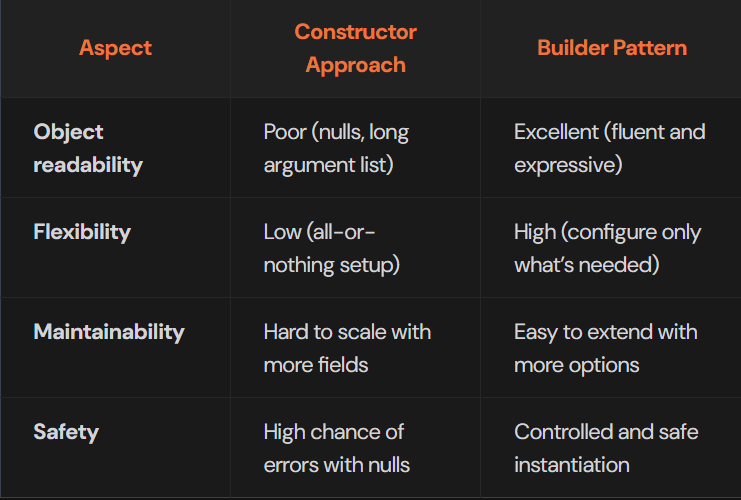
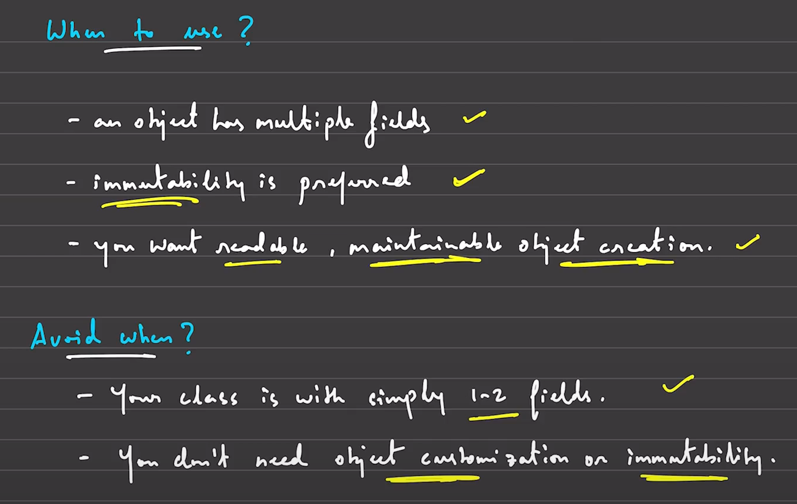

**Builder Pattern**<br><br>
"Builder pattern builds a complex object step by step. It separates the construction of a complex object from its representation, so that the same construction process can create different representations."<br><br>
**In simpler terms:**<br><br>
Imagine you're ordering a custom burger. You choose the bun, patty, toppings, sauces, and whether you want it grilled or toasted. The chef follows your instructions step by step to build your custom burger. This is what the Builder Pattern does — it lets you construct complex objects by specifying their parts one at a time, giving you flexibility and control over the object creation process.<br><br>
**Telescoping Constructor Anti-Pattern**<br><br>
To manage optional parameters, many developers try to solve this by writing multiple overloaded constructors — each with one more optional parameter than the last. For example:<br><br>
```
class BurgerMeal {
    public BurgerMeal(String bun, String patty) { ... }
    public BurgerMeal(String bun, String patty, boolean cheese) { ... }
    public BurgerMeal(String bun, String patty, boolean cheese, String side) { ... }
    public BurgerMeal(String bun, String patty, boolean cheese, String side, String drink) { ... }
}
```
This is called Telescoping Constructor Anti-Pattern.

But this creates a cascade of constructors that become:<br>
**Hard to read** and write<br>
**Error-prone** due to confusing parameter order<br>
**Difficult to maintain** when more fields are added<br>
**Inflexible**, as users must use parameters in a specific order<br><br>
**NOTE:** It occurs most commonly in Java, which lacks support for optional or default parameters (unlike C++ or Python). <br><br>
**The Solution is to use Builder Pattern**
```
import java.util.*;

// Represents a customizable Burger Meal
class BurgerMeal {
    // Required components
    private final String bunType;
    private final String patty;

    // Optional components
    private final boolean hasCheese;
    private final List<String> toppings;
    private final String side;
    private final String drink;

    // Private constructor to force use of Builder
    private BurgerMeal(BurgerBuilder builder) {
        this.bunType = builder.bunType;
        this.patty = builder.patty;
        this.hasCheese = builder.hasCheese;
        this.toppings = builder.toppings;
        this.side = builder.side;
        this.drink = builder.drink;
    }

    // Static nested Builder class
    public static class BurgerBuilder {
        // Required
        private final String bunType;
        private final String patty;

        // Optional
        private boolean hasCheese;
        private List<String> toppings;
        private String side;
        private String drink;

        // Builder constructor with required fields
        public BurgerBuilder(String bunType, String patty) {
            this.bunType = bunType;
            this.patty = patty;
        }

        // Method to set cheese
        public BurgerBuilder withCheese(boolean hasCheese) {
            this.hasCheese = hasCheese;
            return this;
        }

        // Method to set toppings
        public BurgerBuilder withToppings(List<String> toppings) {
            this.toppings = toppings;
            return this;
        }

        // Method to set side
        public BurgerBuilder withSide(String side) {
            this.side = side;
            return this;
        }

        // Method to set drink
        public BurgerBuilder withDrink(String drink) {
            this.drink = drink;
            return this;
        }

        // Final build method
        public BurgerMeal build() {
            return new BurgerMeal(this);
        }
    }
}

class Main {
    public static void main(String[] args) {
        // Creating burger with only required fields
        BurgerMeal plainBurger = new BurgerMeal.BurgerBuilder("wheat", "veg")
                                    .build();

        // Burger with cheese only
        BurgerMeal burgerWithCheese = new BurgerMeal.BurgerBuilder("wheat", "veg")
                                        .withCheese(true)
                                        .build();

        // Fully loaded burger
        List<String> toppings = Arrays.asList("lettuce", "onion", "jalapeno");
        BurgerMeal loadedBurger = new BurgerMeal.BurgerBuilder("multigrain", "chicken")
                                        .withCheese(true)
                                        .withToppings(toppings)
                                        .withSide("fries")
                                        .withDrink("coke")
                                        .build();
    }
}
```
<br><br>

<br><br>

**When to use and when to avoid**
<br><br>
**Real World Products Using Builder Pattern**<br><br>
1. **Lambok's Builder Annotation (Java)**
    * You just have to use **@Builder** for the class you want to have a builder class. And java internally do it for you.<br><br>
2. **Amazon Cart Feature**
    * I won't write anything here. You think about it and you will get it.