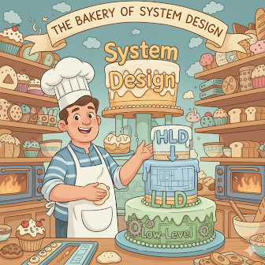

<br><br>
```
Why System Design?
Almost every software enthusiast dreams of working in a tech giant like Amazon, Google, Microsoft, or Meta, or even at a well-established startup like Zomato or Swiggy. All of these companies have one key demand for the candidates they hire: a great understanding of System Design. (And of course, strong DSA skills are a given, but System Design is the secret sauce.)

So, what is this "System Design" everyone talks about? And why do they care so much about this concept? Let's unravel this mystery together.

What is System Design?
At its core, System Design is the process of designing the architecture and components of a software system to meet specific business requirements. It involves translating user requirements into a detailed blueprint that guides the entire implementation phase.


Yeah, that's the bookish definition. But let's break it down into simple terms.

Imagine you're a baker. You can easily bake a single cake in your kitchen. But what if you suddenly get an order for 1,000 cakes a day? You can't do it alone. You need a full production line—a system. You'd need to design the entire operation:

The Recipe (Requirements): What kind of cakes are we making?

The Kitchen (Architecture): How do we lay out the space for maximum efficiency?

The Process (Components): Do we have separate teams for mixing, baking, and decorating?

The Delivery (Interfaces): How do the finished cakes get to the truck?

This is exactly what System Design is for software. It's the process of stepping back from writing code and becoming the architect of the entire operation. The goal is to create a well-organized and efficient structure that meets its purpose while considering crucial factors like scalability, maintainability, and performance.


The Two Sides of System Design: HLD & LLD
System Design is typically divided into two complementary parts: High-Level Design and Low-Level Design. To continue with our bakery analogy, you can think of it like this:


High-Level Design (HLD): The Big Picture

This is the blueprint for your entire bakery. An HLD focuses on the overall system architecture. It outlines the main components and how they interact with each other. It’s about the "what" and "where" without getting into the "how."

In the bakery: This would be the floor plan showing the general location of the mixing station, the baking ovens, the decorating area, and the packing station. It defines the flow of the process from start to finish.

Low-Level Design (LLD): The Fine-Grained Details

This is the detailed plan for each individual station. An LLD focuses on the specific implementation details of a single component. It's about the "how" and "what exactly."

In the bakery: This would be a detailed instruction manual for the baking station. It would specify the exact type of oven to use, the precise temperature and time for each cake, and the specific recipe (ingredients and measurements) for the baker to follow.

Just like in a bakery, a well-designed software system requires both a clear high-level plan and a detailed low-level plan for each component to work together seamlessly.

Compared to Low Level Design, High Level Design is typically done by more senior people who have hands-on experience on software projects.

So, who is this for?
If you're a first or second-year engineering student, my best advice is to focus on mastering OOPs and DSA. However, if you are a third-year student, a recent graduate, or a professional looking to crack interviews and build a strong career, this journey into System Design is for you.

But please, don't study this just for interviews. The concepts we're about to explore are the very essence of software engineering itself.
In this modern age of LLMs and AI, is it truly worth investing your valuable time in a concept this big?

My answer is yes. No AI or other upcoming technology is going to replace these fundamental software concepts. They are as settled as bedrock. No matter the language or technology, the code you write will always need to be scalable, maintainable, and performant.
Conclusion
So, now you know that System Design is much more than just coding—it's about building a robust and scalable blueprint for an entire software system. We've talked about the big-picture planning of High-Level Design and the crucial, nitty-gritty details of Low-Level Design.

In this blog series, our focus will be on mastering the details. We are going to go on a deep dive into Low-Level Design (LLD). We’ll explore the fundamental principles and patterns that allow us to write code that is not just functional, but also clean, flexible, and easy to maintain.

It's time to build the foundation for our skills as software architects.

Join me on September 21st, as we begin our LLD journey with a deep dive into the 5 SOLID principles.
```