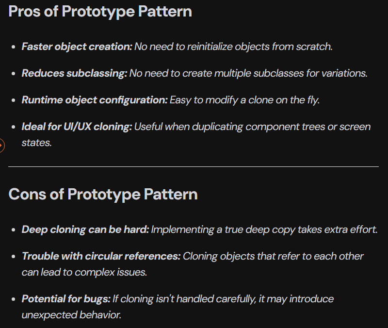
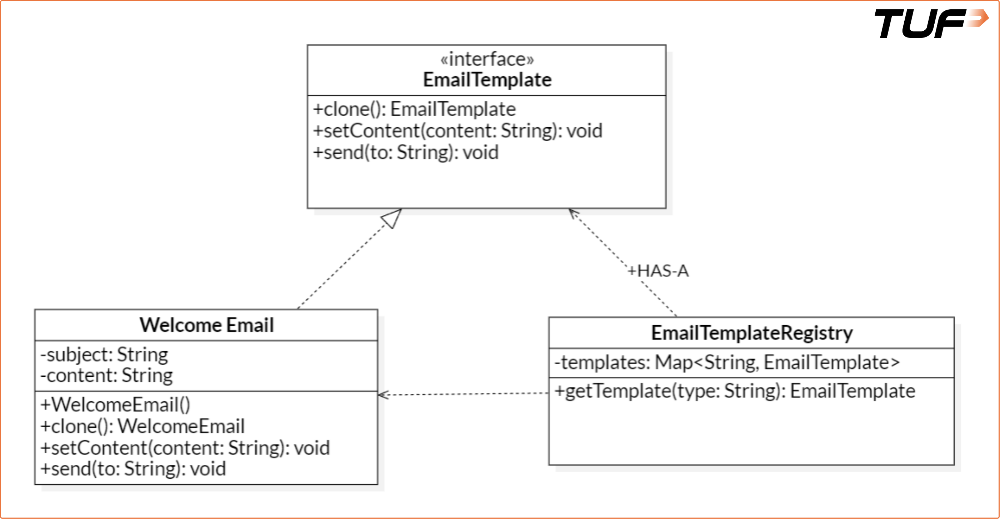

**Prototype Pattern**<br><br>
"Prototype pattern creates duplicate objects while keeping performance in mind. It provides a mechanism to copy the original object to a new one without making the code dependent on their classes."<br><br>
**Real-life Analogy (Photocopy Machine)**<br><br>
Think of preparing ten offer letters. Instead of typing the same letter ten times, you write it once, photocopy it, and change just the name on each copy. This is how the Prototype Pattern works: start with a base object and produce modified copies with minimal changes.<br><br>
**Suitable Use Cases**<br><br>
Apply the Prototype Pattern in these situations:<br>

* Object creation is resource-intensive or complex.
* You require many similar objects with slight variations.
* You want to avoid writing repetitive initialization logic.
* You need runtime object creation without tight class coupling.<br><br>
**Real-life Example**<br><br>
**Bad Code: Incomplete Use of Design Principles**<br><br>
```
import java.util.*;

interface EmailTemplate {
    void setContent(String content);
    void send(String to);
}

// A concrete email class, hardcoded
class WelcomeEmail implements EmailTemplate {
    private String subject;
    private String content;

    public WelcomeEmail() {
        this.subject = "Welcome to TUF+";
        this.content = "Hi there! Thanks for joining us.";
    }

    @Override
    public void setContent(String content) {
        this.content = content;
    }

    @Override
    public void send(String to) {
        System.out.println("Sending to " + to + ": [" + subject + "] " + content);
    }
}

class Main {
    public static void main(String[] args) {
        // Create a welcome email
        WelcomeEmail email1 = new WelcomeEmail();
        email1.send("user1@example.com");

        // Suppose we want a similar email with slightly different content
        WelcomeEmail email2 = new WelcomeEmail();
        email2.setContent("Hi there! Welcome to TUF Premium.");
        email2.send("user2@example.com");

        // Yet another variation
        WelcomeEmail email3 = new WelcomeEmail();
        email3.setContent("Thanks for signing up. Let's get started!");
        email3.send("user3@example.com");
    }
}
```
**Issues in the Bad design**
1. Tight Coupling to Concrete Class:
    * The code uses the WelcomeEmail class directly.
    * No abstraction for cloning—client code is tightly bound to object creation logic (new WelcomeEmail() everywhere).
2. Repetitive Instantiation:
    * For every variation, a new instance is created using the constructor—even though most data remains the same.
    * This leads to unnecessary duplication of code and logic.
3. Violates DRY Principle: Repeated calls to new WelcomeEmail() and then setContent() for slight modifications break the Don't Repeat Yourself principle.
4. No Cloning or Copy Mechanism: There is no concept of cloning or reusing a pre-defined template and just modifying small parts.<br><br>
**Good Code (Prototype Pattern Applied)**<br><br>
```
import java.util.*;

// Defining the Prototype Interface
interface EmailTemplate extends Cloneable {
    EmailTemplate clone(); // Recommended to perform deep copy
    void setContent(String content);
    void send(String to);
}

// Concrete Class implementing clone logic
class WelcomeEmail implements EmailTemplate {
    private String subject;
    private String content;

    public WelcomeEmail() {
        this.subject = "Welcome to TUF+";
        this.content = "Hi there! Thanks for joining us.";
    }

    @Override
    public WelcomeEmail clone() {
        try {
            return (WelcomeEmail) super.clone();
        } catch (CloneNotSupportedException e) {
            throw new RuntimeException("Clone failed", e);
        }
    }

    @Override
    public void setContent(String content) {
        this.content = content;
    }

    @Override
    public void send(String to) {
        System.out.println("Sending to " + to + ": [" + subject + "] " + content);
    }
}

// Template Registry to store and provide clones
class EmailTemplateRegistry {
    private static final Map<String, EmailTemplate> templates = new HashMap<>();

    static {
        templates.put("welcome", new WelcomeEmail());
        // templates.put("discount", new DiscountEmail());
        // templates.put("feature-update", new FeatureUpdateEmail());
    }

    public static EmailTemplate getTemplate(String type) {
        return templates.get(type).clone(); // clone to avoid modifying original
    }
}

// Driver code
class Main {
    public static void main(String[] args) {
        EmailTemplate welcomeEmail1 = EmailTemplateRegistry.getTemplate("welcome");
        welcomeEmail1.setContent("Hi Alice, welcome to TUF Premium!");
        welcomeEmail1.send("alice@example.com");

        EmailTemplate welcomeEmail2 = EmailTemplateRegistry.getTemplate("welcome");
        welcomeEmail2.setContent("Hi Bob, thanks for joining!");
        welcomeEmail2.send("bob@example.com");

        // Reuse the base WelcomeEmail structure, just changing dynamic content
    }
}
```
**Benefits of Good Design**<br><br>
1. Implements clone(): Allows object copying instead of recreation.
2. Introduces Registry: Central location <br>(EmailTemplateRegistry) holds template prototypes.
3. Decouples creation from usage: Client code doesn't depend on how WelcomeEmail is constructed.
4. Improves performance: Avoids complex re-initialization logic by cloning pre-configured templates.<br><br>

**Deep Cloning Vs Shallow Cloning:**
There are two types of cloning in Java: Shallow Cloning and Deep Cloning.<br><br>

In the context of the Prototype Pattern, Deep Cloning is often preferred. This means that when you clone an object, not only the object itself is copied, but also all the objects it references. This ensures that changes to the cloned object do not affect the original object or any of its referenced objects.<br><br>

Deep cloning is considered safer as well than shallow cloning because it avoids unintended side effects and ensures each clone is truly independent — especially important when templates contain complex internal structures (like nested configuration objects, lists, etc.).<br><br>
**Pros and cons**<br><br>
<br><br>
**Class Diagram**<br><br>
